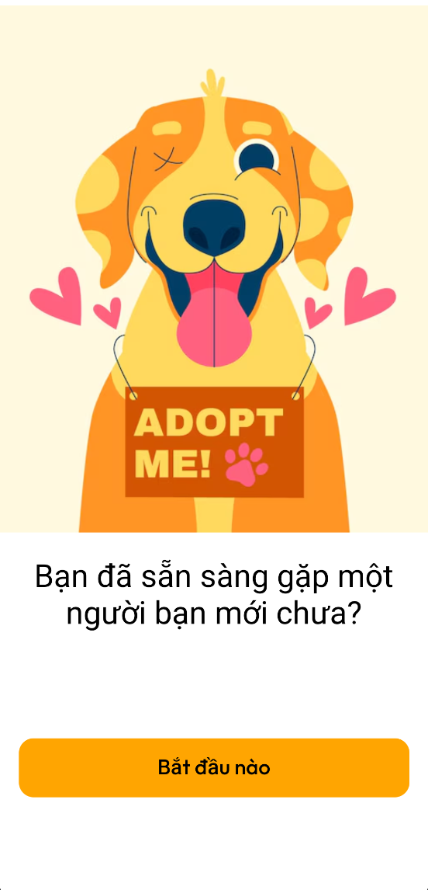

# BÁO CÁO: ỨNG DỤNG NHẬN NUÔI THÚ CƯNG

## 1. Giới thiệu
Hiện nay, nhu cầu nhận nuôi thú cưng đang ngày càng tăng cao, đặc biệt trong giới trẻ và những người yêu động vật. Tuy nhiên, quá trình tìm kiếm, lựa chọn và tiếp cận nguồn thú cưng cần nhận nuôi vẫn còn gặp nhiều khó khăn, thiếu thông tin, và chưa có nền tảng kết nối hiệu quả. Ứng dụng **“PetAdopt”** được xây dựng nhằm giải quyết bài toán trên bằng cách kết nối những người cần cho – nhận thú cưng trên nền tảng di động.

## 2. Mục tiêu của ứng dụng
- Hỗ trợ người dùng dễ dàng tìm kiếm, đăng ký nhận nuôi thú cưng.
- Tạo môi trường kết nối giữa những người cho – nhận thú cưng một cách minh bạch, tiện lợi.
- Cung cấp thông tin chăm sóc, tư vấn y tế.

## 3. Tính năng chính

### 3.1. Đăng nhập/Đăng ký tài khoản
- Hỗ trợ xác thực qua email, Google, hoặc mạng xã hội.
- Lưu thông tin người dùng, vai trò (người cho, người nhận).

### 3.2. Đăng tin cho thú cưng cần nhận nuôi
- Cho phép người dùng đăng tải thông tin thú cưng: hình ảnh, mô tả, thông tin về vật nuôi.

### 3.3. Liên hệ và nhắn tin
- Tính năng chat giữa người nhận và người cho thú cưng.

### 3.4. Tư vấn chăm sóc
- Cung cấp kiến thức chăm sóc, huấn luyện thú cưng.
- - Tích hợp hỗ trợ phản hồi tự động từ chatbot với vai trò **"Bác sĩ thú y"** để giải đáp thắc mắc.

## 4. Công nghệ sử dụng
- **Frontend:** React Native (JavaScript)
- **Backend:** Firebase (Firestore, Storage), Clerk (Authentication)
- **Expo Go**

## 5. Giao diện người dùng
- Giao diện thân thiện, dễ sử dụng với màu sắc tươi sáng, hình ảnh dễ thương.
- Thiết kế tối ưu cho thiết bị di động.

### Đăng nhập

|  |  |
|:--:|:--:|
| Màn hình bắt đầu | Đăng nhập tài khoản |

**Bạn có thể chọn tài khoản Google ngay trên thiết bị của bạn:**

---

### Tabs (Home, Favorite, AI, Inbox, Profile)

|  |  |  |
|:--:|:--:|:--:|
| Home | Favorite | AI |

|  |  |
|:--:|:--:|
| Inbox | Profile |

---

### Thông tin chi tiết về thú cưng

---

### Thêm thú cưng

|  |  |
|:--:|:--:|
| Thêm thú cưng - Bước 1 | Thêm thú cưng - Bước 2 |

---

### Quản lý bài đăng

## 6. Đánh giá và hướng phát triển

### Ưu điểm:
- Giao diện đẹp, dễ sử dụng.
- Kết nối cộng đồng yêu thú cưng nhanh chóng.
- Có tích hợp AI để hỗ trợ người dùng trong việc chăm sóc thú cưng.

### Hạn chế:
- Cần xác minh người dùng kỹ hơn để tránh tình trạng lừa đảo.
- Cần phát triển thêm hệ thống đánh giá, phản hồi sau nhận nuôi.

### Hướng phát triển:
- Thêm tính năng định vị thú cưng bị lạc.
- Tích hợp hệ thống tiêm chủng và hồ sơ y tế điện tử.
- Hợp tác với các trạm cứu hộ và phòng khám thú y.

## 7. Kết luận
Ứng dụng **“PetAdopt”** không chỉ là cầu nối giữa người cho và người nhận nuôi thú cưng mà còn góp phần lan tỏa thông điệp nhân văn, khuyến khích yêu thương động vật và nâng cao ý thức chăm sóc thú cưng trong cộng đồng. Đây là một bước tiến mới trong việc áp dụng công nghệ để phục vụ mục tiêu xã hội.

------------------------------------
------------------------------------

# Test case

### Test Case 1: Đăng Nhập 
| **Thành phần**          | **Chi tiết**                                                                 |
|-------------------------|-----------------------------------------------------------------------------|
| **Test Case ID**        | TC_Login                                                          |
| **Tên Test Case**       | Kiểm tra đăng nhập với Google                                              |
| **Mô tả**               | Kiểm tra xem người dùng có thể đăng nhập thành công bằng tài khoản Google không. |
| **Điều kiện tiên quyết** | - Ứng dụng đã được cài đặt và mở trên thiết bị. - Người dùng chưa đăng nhập. - Tài khoản Google đã được liên kết với ứng dụng trước đó hoặc có thể đăng nhập. |
| **Dữ liệu đầu vào**     | - Không có dữ liệu đầu vào cụ thể, sử dụng tài khoản Google.               |
| **Các bước thực hiện**   | 1. Mở ứng dụng. 2. Nhấn vào nút "Bắt đầu nào", ứng dụng chuyển sang phần đăng nhập với tài khoản Google . 3. Chọn tài khoản Google để đăng nhập, có thể thêm tài khoản vào thiết bị. 4. Nhập mật khẩu Google nếu được yêu cầu. |
| **Kết quả mong đợi**     | - Hệ thống chuyển hướng đến màn hình chính (Home). - Người dùng có thể truy cập các chức năng khác của ứng dụng. |
| **Kết quả thực tế**      | - Hiển thị màn hình Home với đầy đủ chức năng                                                  |
| **Trạng thái**          | Pass                                                               |

### Test Case 2: Điều Hướng Giữa Các Tab Chính
| **Thành phần**          | **Chi tiết**                                                                 |
|-------------------------|-----------------------------------------------------------------------------|
| **Test Case ID**        | TC_Navigation                                                           |
| **Tên Test Case**       | Kiểm tra điều hướng giữa các tab chính                                     |
| **Mô tả**               | Kiểm tra xem người dùng có thể chuyển đổi giữa các tab chính (Home, Favorites, AI, Inbox, Profile) một cách mượt mà không. |
| **Điều kiện tiên quyết** | - Người dùng đã đăng nhập thành công. - Ứng dụng đang ở màn hình chính (Home). |
| **Dữ liệu đầu vào**     | - Không có dữ liệu đầu vào cụ thể.                                         |
| **Các bước thực hiện**   | 1. Xác nhận rằng đang ở tab Home. 2. Nhấn vào tab Favorites. 3. Xác nhận rằng đã chuyển sang tab Favorites. 4. Nhấn vào tab AI. 5. Xác nhận rằng đã chuyển sang tab AI. 6. Nhấn vào tab Inbox. 7. Xác nhận rằng đã chuyển sang tab Inbox. 8. Nhấn vào tab Profile. 9. Xác nhận rằng đã chuyển sang tab Profile. 10. Nhấn vào tab Home. 11. Xác nhận rằng đã chuyển lại sang tab Home. |
| **Kết quả mong đợi**     | - Mỗi lần nhấn vào tab, ứng dụng chuyển sang tab tương ứng mà không có lỗi. - Giao diện của từng tab được hiển thị đúng. |
| **Kết quả thực tế**      | - Chuyển đổi giữa các tab mượt mà, animation khi chuyển tab                                                   |
| **Trạng thái**          | Pass                                                                 |

### Test Case 3: Xem Thông Tin Chi Tiết Thú Cưng
| **Thành phần**          | **Chi tiết**                                                                 |
|-------------------------|-----------------------------------------------------------------------------|
| **Test Case ID**        | TC_PetDetails                                                           |
| **Tên Test Case**       | Kiểm tra xem thông tin chi tiết thú cưng                                    |
| **Mô tả**               | Kiểm tra xem người dùng có thể xem thông tin chi tiết của một thú cưng đã có trong hệ thống không. |
| **Điều kiện tiên quyết** | - Người dùng đã đăng nhập thành công. - Có ít nhất một thú cưng đã được thêm vào. |
| **Dữ liệu đầu vào**     | - Không có dữ liệu đầu vào cụ thể.                                              |
| **Các bước thực hiện**   | 1. Đi đến tab Home hoặc My Post (trong tab Profile). 2. Nhấn vào thú cưng bất kỳ. 3. Xem thông tin chi tiết của thú cưng. |
| **Kết quả mong đợi**     | - Màn hình Pet Details được hiển thị với thông tin của thú cưng bao gồm tên, loài, tuổi, giới tính, ảnh, và các thông tin khác liên quan. |
| **Kết quả thực tế**      | Hiển thị đầy đủ thông tin của thú cưng.                                                    |
| **Trạng thái**          | Pass                                                                 |

### Test Case 4: Thêm Thú Cưng Mới 
| **Thành phần**          | **Chi tiết**                                                                 |
|-------------------------|-----------------------------------------------------------------------------|
| **Test Case ID**        | TC_AddNewPet                                                           |
| **Tên Test Case**       | Kiểm tra thêm thú cưng mới                                        |
| **Mô tả**               | Kiểm tra xem người dùng có thể bắt đầu quá trình thêm thú cưng mới và nhập thông tin cơ bản không. |
| **Điều kiện tiên quyết** | - Người dùng đã đăng nhập thành công. |
| **Dữ liệu đầu vào**     | - Picture.  - Pet name: Luna  - Pet Category: Cat  - Breed: abc  - Age: 2 - Gender: Male  -Weight: 2  -Address: Hanoi  -About: Very well   |
| **Các bước thực hiện**   | 1. Nhấn vào nút biểu tượng thêm thú cưng hoặc "Add New Pet" (trong tab Profile). 2. Trên màn hình Add New Pet , nhập thông tin vào các trường. 3. Nhấn "Submit". |
| **Kết quả mong đợi**     | - Nếu nhập thiếu thông tin, yêu cầu nhập đầy đủ. - Hệ thống lưu thông tin thú cưng mới. - Chuyển hướng về màn hình Home, với thú cưng mới được hiển thị và xuất hiện trong "My Post".  |
| **Kết quả thực tế**      | Thông tin về thú cưng được hiển thị đầy đủ và đúng theo dữ liệu đầu vào.                                                    |
| **Trạng thái**          | Pass                                                                 |

### Test Case 5: Quản Lý Bài Đăng
| **Thành phần**          | **Chi tiết**                                                                 |
|-------------------------|-----------------------------------------------------------------------------|
| **Test Case ID**        | TC_ManagePosts                                                          |
| **Tên Test Case**       | Kiểm tra quản lý bài đăng                                                  |
| **Mô tả**               | Kiểm tra xem người dùng có thể xem hoặc xóa bài đăng của mình không. |
| **Điều kiện tiên quyết** | - Người dùng đã đăng nhập thành công. - Người dùng đã có ít nhất một bài đăng trong hệ thống. |
| **Dữ liệu đầu vào**     | -  Thú cưng đã được người dùng thêm vào                                            |
| **Các bước thực hiện**   | 1. Đi đến tab Profile vào mục My Post. 2. Tìm và nhấn vào bài đăng bất kỳ. 3. Nhấn vào xem chi tiết bài đăng. 4. Nhấn vào nút "Xóa" . 5. Xác nhận xóa bài đăng. 6. Xác nhận rằng bài đăng đã bị xóa khỏi danh sách. |
| **Kết quả mong đợi**     | - Người dùng có thể xem chi tiết bài đăng. - Người dùng có thể xóa bài đăng thành công. - Sau khi xóa, bài đăng không còn hiển thị trong danh sách. |
| **Kết quả thực tế**      | -My Post hiển thị đầy đủ bài đăng của người dùng. - Khi xóa và xác nhận xóa, bài đăng xóa khỏi danh sách.                                                    |
| **Trạng thái**          | Pass                                                                 |

### Test Case 6: Thêm thú cưng vào Favorite
| **Thành phần**          | **Chi tiết**                                                                 |
|-------------------------|-----------------------------------------------------------------------------|
| **Test Case ID**        | TC_Favorites                                                          |
| **Tên Test Case**       | Kiểm tra xem khi thêm thú cưng vào mục yêu thích đăng                                                  |
| **Mô tả**               | Kiểm tra xem người dùng có thể nhấn vào biểu tượng thêm vào danh sách Favorite hay không. |
| **Điều kiện tiên quyết** | - Người dùng đã đăng nhập thành công. - Đã có ít nhất một bài đăng trong hệ thống. |
| **Dữ liệu đầu vào**     | -  Thú cưng đã được người dùng thêm vào favorite                                           |
| **Các bước thực hiện**   | 1. Đi đến tab Home. 2. Tìm và nhấn vào bài đăng bất kỳ. 3. Nhấn vào biểu tượng hình trái tim. 4. Đi đến tab Favorite để xem các thú cung đã được thêm vào . |
| **Kết quả mong đợi**     | - Người dùng nhấn vào biểu tượng hình trái tim sẽ chuyển sang màu đỏ. - tab Favorite hiển thị đầy đủ những thú cưng đã được thêm.|
| **Kết quả thực tế**      | - Biểu tượng chuyển sang màu đỏ.  - Danh sách đầy đủ của các thú cưng đã được yêu thích trong tab Favorite.                                                    |
| **Trạng thái**          | Pass                                                                 |

### Test Case 7: Chatbot Trả Lời Câu Hỏi Chăm Sóc Thú Cưng Cơ Bản
| **Thành phần**          | **Chi tiết**                                                                 |
|-------------------------|-----------------------------------------------------------------------------|
| **Test Case ID**        | TC_Chatbot_1                                                             |
| **Tên Test Case**       | Kiểm tra chatbot trả lời câu hỏi chăm sóc thú cưng cơ bản                  |
| **Mô tả**               | Kiểm tra xem chatbot có thể trả lời đúng các câu hỏi chăm sóc thú cưng cơ bản không. |
| **Điều kiện tiên quyết** | - Người dùng đã đăng nhập thành công. - Người dùng đang ở tab AI |
| **Dữ liệu đầu vào**     | - Câu hỏi: "Chó con của tôi 1 tháng tuổi nên cho ăn gì?"                                        |
| **Các bước thực hiện**   | 1. Mở ứng dụng và đi đến tab AI. 2. Nhập "Tôi nên cho chó ăn gì?" vào ô chat. 3. Nhấn nút gửi. |
| **Kết quả mong đợi**     | - Chatbot trả lời với thông tin chính xác về đồ ăn phù hợp với đối tượng được nhắc đến." |
| **Kết quả thực tế**      | - Chatbot trả lời phù hợp :"Chó con 1 tháng tuổi cần sữa mẹ là chính. Nếu chó mẹ không đủ sữa hoặc không có sữa, cần cho bé bú sữa thay thế dành riêng cho chó con, mua tại các cửa hàng thú cưng uy tín. Tuyệt đối không cho uống sữa bò. Nếu chó con có dấu hiệu yếu ớt, bỏ ăn, tiêu chảy, nôn mửa, hãy đưa bé đến bác sĩ thú y ngay lập tức."                                                     |
| **Trạng thái**          |  Pass                                                              |

### Test Case 8: Chatbot Xử Lý Câu Hỏi Sức Khỏe Thú Cưng
| **Thành phần**          | **Chi tiết**                                                                 |
|-------------------------|-----------------------------------------------------------------------------|
| **Test Case ID**        | TC_Chatbot_2                                                             |
| **Tên Test Case**       | Kiểm tra chatbot xử lý câu hỏi liên quan đến sức khỏe thú cưng              |
| **Mô tả**               | Kiểm tra xem chatbot có thể cung cấp thông tin chính xác về các vấn đề sức khỏe thú cưng không. |
| **Điều kiện tiên quyết** | - Người dùng đã đăng nhập thành công. - Người dùng đang ở tab AI. |
| **Dữ liệu đầu vào**     | - Câu hỏi: "Chó con của tôi bỏ ăn 2 ngày rồi, nó bị chảy nước dãi, mắt lờ đờ"                      |
| **Các bước thực hiện**   | 1. Mở ứng dụng và đi đến tab AI. 2. Nhập dữ liệu vào ô chat. 3. Nhấn nút gửi. |
| **Kết quả mong đợi**     | - Chatbot trả lời với thông tin phù hợp, với những trường hợp nghiêm trọng, khuyên người dùng đưa thú cưng đến bác sĩ ngay lập tức. |
| **Kết quả thực tế**      | - Chatbot trả lời: "Chó con bỏ ăn kèm chảy nước dãi và mắt lờ đờ là dấu hiệu đáng lo ngại. Đây có thể là dấu hiệu của nhiều bệnh lý, từ nhiễm trùng đơn giản đến bệnh nghiêm trọng hơn. Hãy đưa chó con đến bác sĩ thú y ngay lập tức. Không nên tự điều trị tại nhà. Việc trì hoãn có thể gây nguy hiểm cho sức khỏe của chó con."                                                    |
| **Trạng thái**          | Pass                                                                 |

### Test Case 9: Người Nhận Nuôi Gửi Tin Nhắn Đến Người Cho Thú Cưng
| **Thành phần**          | **Chi tiết**                                                                 |
|-------------------------|-----------------------------------------------------------------------------|
| **Test Case ID**        | TC_Message1                                                  |
| **Tên Test Case**       | Kiểm tra người nhận nuôi gửi tin nhắn đến người cho thú cưng                |
| **Mô tả**               | Kiểm tra xem người nhận nuôi có thể gửi tin nhắn đến người cho thú cưng qua ứng dụng để hỏi về thú cưng không. |
| **Điều kiện tiên quyết** | - Người nhận nuôi đã đăng nhập thành công với tài khoản Google hợp lệ . - Có một bài đăng về thú cưng cần cho . |
| **Dữ liệu đầu vào**     | - Nội dung tin nhắn: "hello" |
| **Các bước thực hiện**   | 1. Mở ứng dụng và đăng nhập với tài khoản Google. 2. Đi đến tab Home . 3. Tìm và nhấn vào bài đăng về thú cưng . 4. Nhấn nút "Adopt Me" trên trang chi tiết thú cưng. 5. Nhập nội dung tin nhắn: "hello" 6. Nhấn nút gửi. |
| **Kết quả mong đợi**     | - Tin nhắn được gửi thành công. - Hiển thị tin nhắn đã được gửi. - Tin nhắn xuất hiện trong tab Inbox. |
| **Kết quả thực tế**      | Tin nhắn gửi thành công và xuất hiện trong tab Inbox                                                    |
| **Trạng thái**          | Pass                                                                 |

### Test Case 10: Người Cho Thú Cưng Nhận và Xem Tin Nhắn Từ Người Nhận Nuôi
| **Thành phần**          | **Chi tiết**                                                                 |
|-------------------------|-----------------------------------------------------------------------------|
| **Test Case ID**        | TC_Message2                                                  |
| **Tên Test Case**       | Kiểm tra người cho thú cưng nhận và xem tin nhắn từ người nhận nuôi         |
| **Mô tả**               | Kiểm tra xem người cho thú cưng có thể nhận và xem tin nhắn từ người nhận nuôi trong tab Inbox không. |
| **Điều kiện tiên quyết** | - Người cho thú cưng đã đăng nhập thành công với tài khoản Google hợp lệ . - Người nhận nuôi đã gửi một tin nhắn liên quan đến thú cưng được đăng. |
| **Dữ liệu đầu vào**     | - Không có dữ liệu đầu vào cụ thể.                                         |
| **Các bước thực hiện**   | 1. Mở ứng dụng và đăng nhập với tài khoản Google. 2. Đi đến tab Inbox . 3. Kiểm tra danh sách tin nhắn và nhấn vào cuộc trò chuyện với người nhận nuôi. |
| **Kết quả mong đợi**     | - Tin nhắn từ người nhận nuôi được hiển thị rõ ràng, ví dụ: "Hello" - Tin nhắn được hiển thị đúng thời gian nhận. |
| **Kết quả thực tế**      | Nhận được tin nhắn và thời gian chính xác                                                    |
| **Trạng thái**          | Pass                                                                 |

### Test Case 11: Người Nhận Nuôi Nhận và Xem Tin Nhắn Từ Người Cho Thú Cưng
| **Thành phần**          | **Chi tiết**                                                                 |
|-------------------------|-----------------------------------------------------------------------------|
| **Test Case ID**        | TC_Message3                                                  |
| **Tên Test Case**       | Kiểm tra người nhận nuôi nhận và xem tin nhắn từ người cho thú cưng         |
| **Mô tả**               | Kiểm tra xem người nhận nuôi có thể nhận và xem tin nhắn từ người cho thú cưng trong tab Inbox không. |
| **Điều kiện tiên quyết** | - - Người nhận nuôi đã đăng nhập thành công với tài khoản Google hợp lệ . - Người cho thú cưng đã gửi một tin nhắn liên quan đến thú cưng. |
| **Dữ liệu đầu vào**     | - Không có dữ liệu đầu vào cụ thể.                                         |
| **Các bước thực hiện**   | 1. Mở ứng dụng và đăng nhập với tài khoản Google. 2. Đi đến tab Inbox. 3. Kiểm tra danh sách tin nhắn và nhấn vào cuộc trò chuyện với người cho thú cưng. |
| **Kết quả mong đợi**     | - Tin nhắn từ người cho thú cưng được hiển thị rõ ràng, ví dụ: "Chào bạn" - Tin nhắn hiển thị đúng thời gian nhận. |
| **Kết quả thực tế**      | Tin nhắn được hiển thị đúng thời gian nhận.                                                    |
| **Trạng thái**          | Pass                                                                 |